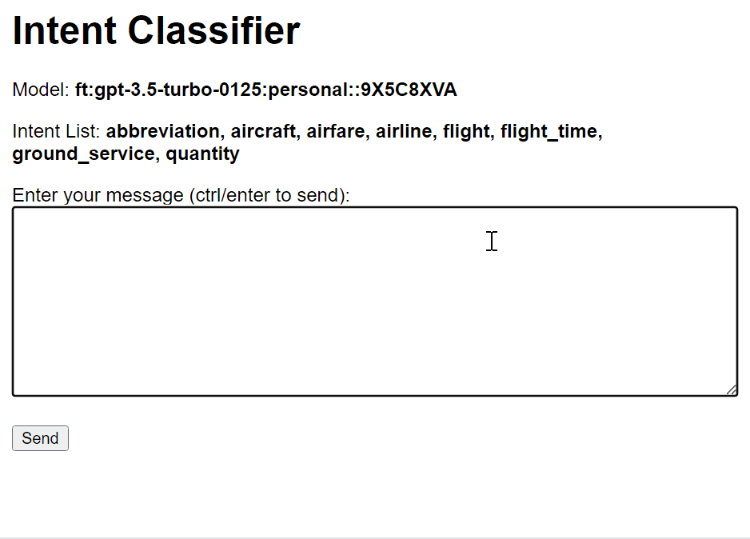
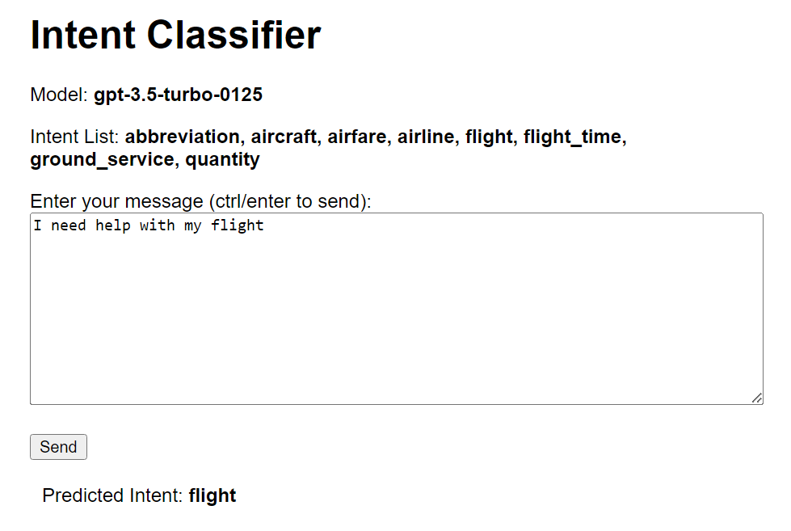
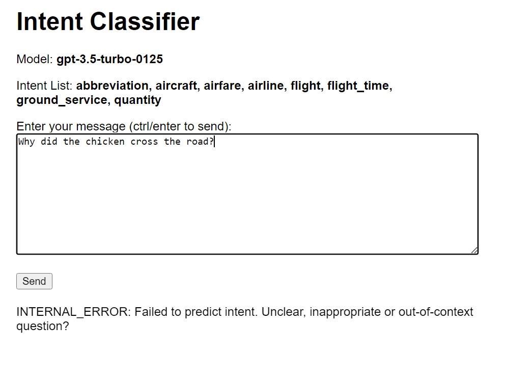

# Intent Classifier based on fine-tuned GPT3

  

## Project Presentation
The goal of this project is to implement a zero- or few-shot intent classifier based on a fine-tuned GPT3 model, that can be used to provide inferencing service via an HTTP Service.

## Prerequisites
To run the project and notebook code, you need a valid [OpenAI API key](https://platform.openai.com/api-keys).  
Create an .env file at the root an add your API-key to it (no quotes). See .*env-example*.

## Project Research
See the *project_research.ipynb* notebook for my review of the ATIS dataset, as well as in-depth research on testing and fine-tuning GPT3 to perform intent classification.

The required modules to run the notebook code are listed at the beginning. Create a virtual environment if necessary and run the **Modules Installation** cell. 

This notebook is available on [Kaggle](https://www.kaggle.com/code/alexandredj/intent-classifier-based-on-fine-tuned-gpt3) too.

## Run the project
To run the intent-classifier, you can use one of the following two solutions:

### In a virtual environment
Pull the repository, create a virtual environment and install the modules as follows:  

```
git clone https://github.com/alexdjulin/openai-intent-classifier.git
cd openai-intent-classifier
python -m venv .venv
.venv\Scripts\activate.bat
pip install -r requirements.txt
```

Run the Flask server as follows. You can pass two arguments:  
- `--model/-m`: Required. The GPT model name-id to use (without quotes).
- `--port/-p`: Optional. The server port number to use, if you expose a different one than the default value (8080).
  
```
python server.py --model gpt-3.5-turbo-0125
python server.py --model gpt-3.5-turbo-0125 --port 5000
```
### In a Docker container
If you have [Docker](https://docs.docker.com/get-docker/) installed, you can pull the project's repository and run the docker image as follows. Make sure you pass your .env file as argument, as it won't be copied inside the docker instance.  

```
git clone https://github.com/alexdjulin/openai-intent-classifier.git
cd openai-intent-classifier
docker build -t intent-classifier .
docker run -p 8080:8080 --env-file .env intent-classifier --model gpt-3.5-turbo-0125

# Or if you want to expose a different port
docker run -p 5000:5000 --env-file .env intent-classifier --model gpt-3.5-turbo-0125 --port 5000
```

### Model swapping
Edit the model name-id to use a different base or fine-tuned GPT model.  
Example: `gpt-3.5-turbo-0125` --> `ft:gpt-3.5-turbo-0125:personal::9TSgWFtt`

### Prompt editing
Edit the contents of *prompt.jsonl* to alter the prompt used when calling the OpenAI API to perform intent classification. 

Edit the list of available intents listed in *intents.txt*. Add or remove intents as desired, one per line. These are added to the prompt at runtime.

## Project UI
Once the server is running, you can access the server at the address:  http://127.0.0.1:8080  
Edit the port if you are using a different one.  

The UI frontend is very basic: It displays the loaded model, the list of valid intents and lets you input a message.  
If the prediction is successful, the predicted intent will be listed as below.

  

If the model or the server encounters an error, the error label and message will be listed instead.  



## Project files

Here is a short description of project files required to run the app properly:  

- **server.py**: Runs the Flask server and handles prediction calls.
- **intent_classifier.py**: Main class instanciating an OpenAI client to predict the intent of an input message.
- **templates/index.html**: Frontend html page rendered and updated by the Flask server.
- **prompt.jsonl**: Contains the prompt sent to OpenAI.
- **intents.txt**: List the valid intents our model should chose from. This list is loaded and replaces the INTENT_LIST tag in the prompt at runtime.
- **.env**: Environment file containing a valid OpenAI API key. See *.env-example*.

Additional files generated at runtime:
- **history.jsonl**: Used to save prompt history and keep a local copy of the conversation. Saving conversations between models and customers would allow us to re-load one later if needed.

## API calls testing

You can run the following requests to test how the server responds to different API calls.

```bash
# SUCCESSFUL REQUEST
curl -X POST -H "Content-Type: application/json" -d "{\"text\": \"What is the earliest flight to Paris?\"}" http://localhost:8080/intent
Response: {"intent":"flight_time"}

# MODEL NOT READY
# Start the server with a wrong model id and run a prediction.
# E.g.: python server.py --model gpt-3.5-cargo
Response: {"label":"MODEL_NOT_READY","message":"Model not ready. Check the model name-id."}

# PREDICTION FAILED
curl -X POST -H "Content-Type: application/json" -d "{\"text\": \"I want a burger and some fries\"}" http://localhost:8080/intent
Response: {"label":"INTERNAL_ERROR","message":"Failed to predict intent. Unclear, inappropriate or out-of-context question?"}

# BODY MISSING
curl -X POST -H "Content-Type: application/json" -d "{}" http://localhost:8080/intent
Response: {"label":"BODY_MISSING","message":"Request doesn't have a body."}

# TEXT MISSING
curl -X POST -H "Content-Type: application/json" -d "{\"question\": \"What is the earliest flight to Paris\"}" http://localhost:8080/intent
Response: {"label":"TEXT_MISSING","message":"\"text\" missing from request body."}


```
